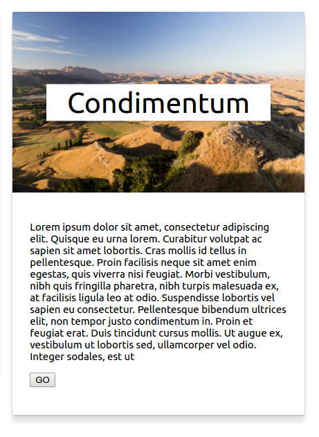

# simple-card
Simple card component with polymer



# Install
Import the  `simple-card.html` file:

> <link rel="import" href="simple-card.html">

Usage:

```html
  <simple-card title="Vestibulum" img-src="images/b8rkmfxzjdu-jordan-whitt.jpg">
      <p>
        Lorem ipsum dolor sit amet, consectetur adipiscing elit. Quisque eu urna lorem. Curabitur volutpat ac sapien sit amet lobortis.
        Cras mollis id tellus in pellentesque. Proin facilisis neque sit amet enim egestas, quis viverra nisi feugiat. Morbi
        vestibulum, nibh quis fringilla pharetra, nibh turpis malesuada ex, at facilisis ligula leo at odio
      <p>
    <button type="button">GO</button>
  </simple-card>
```


